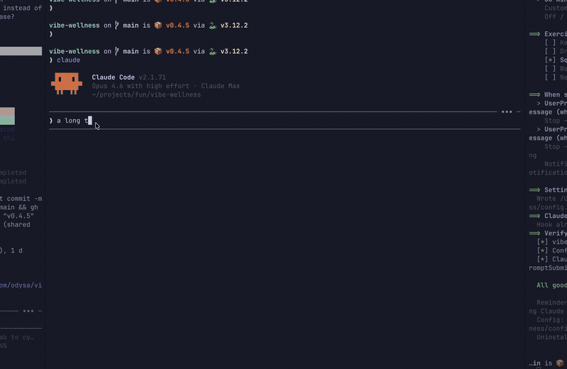

# vibe-wellness

[](https://pypi.org/project/vibe-wellness/) [](https://github.com/odysa/vibe-wellness/actions/workflows/publish.yml)  

[中文](README_zh.md)

**I vibe-code 8+ hours a day. Hours disappear, my back hurts, I forget to drink water. Sound familiar?**

**Claude Code doesn't need to stretch. You do.**



vibe-wellness is a native macOS overlay that hooks directly into Claude Code to remind you to move, stretch, and hydrate — *inside* your workflow, not as notifications you'll ignore.

- 3-second countdown with exercise name
- Animated stick figure GIF showing the exercise
- Progress bar + auto-dismiss after 30 seconds (or click to dismiss)

## 30-second setup

One-liner:

```bash
curl -fsSL https://raw.githubusercontent.com/odysa/vibe-wellness/main/install.sh | bash
```

Or with [uv](https://docs.astral.sh/uv/):

```bash
uvx vibe-wellness
```

Both methods will:
1. Install `vibe-wellness` via `uv tool install`
2. Run the interactive setup wizard (language, interval, exercises, hook)
3. Create a hook script at `~/.claude/hooks/vibe-wellness/show.sh`
4. Register the hook in `~/.claude/settings.json`

### Re-configure

Run `vibe-wellness` again to change settings.

## Exercises

| Key | English | 中文 |
|-----|---------|------|
| `kegels` | Kegels | 提肛 |
| `drink_water` | Drink Water | 喝水 |
| `squats` | Squats | 深蹲 |
| `wall_pushups` | Wall Push-ups | 靠墙俯卧撑 |
| `neck_rolls` | Neck Rolls | 颈椎运动 |

All exercises include animated stick figure GIFs.

## Configuration

Edit `~/.config/vibe-wellness/config.json`:

```json
{
  "lang": "zh",
  "interval": 15
}
```

| Key | Default | Description |
|-----|---------|-------------|
| `lang` | `"auto"` | `"en"`, `"zh"`, or `"auto"` (detect system) |
| `interval` | `15` | Minutes between exercise reminders |
| `duration` | `30` | Overlay display time in seconds |
| `opacity` | `0.95` | Window opacity (0.0 - 1.0) |
| `exercises` | (built-in) | Custom exercise list |
| `sedentary.enabled` | `true` | Enable sedentary reminder |
| `sedentary.interval` | `30` | Minutes between sedentary alerts |

### Custom exercises

Exercises merge with defaults by `key`:

```json
{
  "exercises": [
    { "key": "stretching", "name": { "en": "Stretch", "zh": "拉伸" } }
  ]
}
```

### Custom GIFs

Drop `{key}.gif` in `~/.config/vibe-wellness/gifs/` to override any exercise animation.

## Uninstall

```bash
vibe-wellness --uninstall
```

## How it works

```
~/.claude/settings.json          Hook triggers on UserPromptSubmit/Stop/Notification
  -> ~/.claude/hooks/vibe-wellness/show.sh
    -> ~/.local/bin/vibe-wellness --show
      -> checks interval + single-instance lock
      -> spawns overlay (tkinter, borderless, always-on-top)
```

```
vibe_wellness/
  cli.py          Entry point
  installer.py    Interactive setup wizard (TUI)
  show.py         Single-instance guard + interval check
  ui.py           Overlay window (tkinter + CoreGraphics + ObjC runtime)
  config.py       Config loading, i18n, language detection
  uninstall.py    Clean removal
  config.json     Default exercises
  gifs/           Bundled exercise GIFs
```
