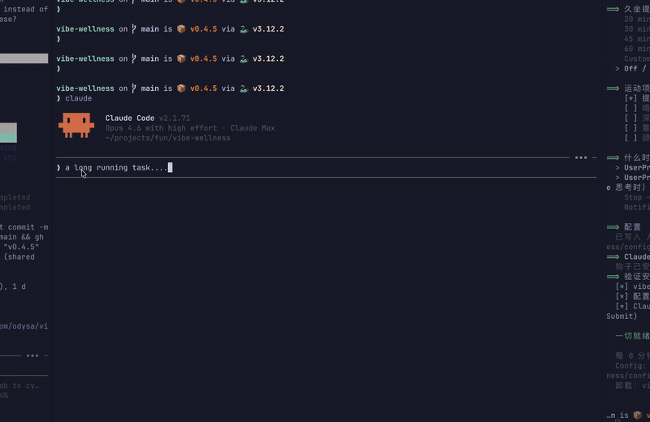

# vibe-wellness

[English](README.md)

macOS 运动提醒插件。在使用 Claude Code 时弹出浮窗，提醒你活动身体。

[](https://pypi.org/project/vibe-wellness/) [](https://github.com/odysa/vibe-wellness/actions/workflows/publish.yml)  



## 功能

使用 Claude Code 时，浮窗会定期弹出：

1. 3 秒倒计时 + 运动名称
2. 火柴人动画演示
3. 进度条 + 30 秒后自动消失（或点击关闭）

另外还有独立的**久坐提醒**，提醒你站起来活动。

## 安装

一行命令：

```bash
curl -fsSL https://raw.githubusercontent.com/odysa/vibe-wellness/main/install.sh | bash
```

或用 [uv](https://docs.astral.sh/uv/)：

```bash
uvx vibe-wellness
```

安装流程：
1. 通过 `uv tool install` 安装
2. 运行交互式配置向导（语言、间隔、运动项目、钩子）
3. 创建钩子脚本 `~/.claude/hooks/vibe-wellness/show.sh`
4. 注册到 `~/.claude/settings.json`

### 重新配置

再次运行 `vibe-wellness` 即可修改设置。

## 运动项目

| Key | English | 中文 |
|-----|---------|------|
| `kegels` | Kegels | 提肛 |
| `drink_water` | Drink Water | 喝水 |
| `squats` | Squats | 深蹲 |
| `wall_pushups` | Wall Push-ups | 靠墙俯卧撑 |
| `neck_rolls` | Neck Rolls | 颈椎运动 |

所有运动都配有火柴人动画。

## 配置

编辑 `~/.config/vibe-wellness/config.json`：

```json
{
  "lang": "zh",
  "interval": 15
}
```

| 配置项 | 默认值 | 说明 |
|--------|--------|------|
| `lang` | `"auto"` | `"en"`、`"zh"` 或 `"auto"`（自动检测） |
| `interval` | `15` | 运动提醒间隔（分钟） |
| `duration` | `30` | 浮窗显示时长（秒） |
| `opacity` | `0.95` | 窗口透明度（0.0 - 1.0） |
| `exercises` | （内置） | 自定义运动列表 |
| `sedentary.enabled` | `true` | 启用久坐提醒 |
| `sedentary.interval` | `30` | 久坐提醒间隔（分钟） |

### 自定义运动

```json
{
  "exercises": [
    { "key": "stretching", "name": { "en": "Stretch", "zh": "拉伸" } }
  ]
}
```

### 自定义动画

将 `{key}.gif` 放到 `~/.config/vibe-wellness/gifs/` 即可覆盖内置动画。

## 卸载

```bash
vibe-wellness --uninstall
```

## 工作原理

```
~/.claude/settings.json          钩子在 UserPromptSubmit/Stop/Notification 时触发
  -> ~/.claude/hooks/vibe-wellness/show.sh
    -> ~/.local/bin/vibe-wellness --show
      -> 检查间隔 + 单实例锁
      -> 弹出浮窗（tkinter, 无边框, 置顶）
```
